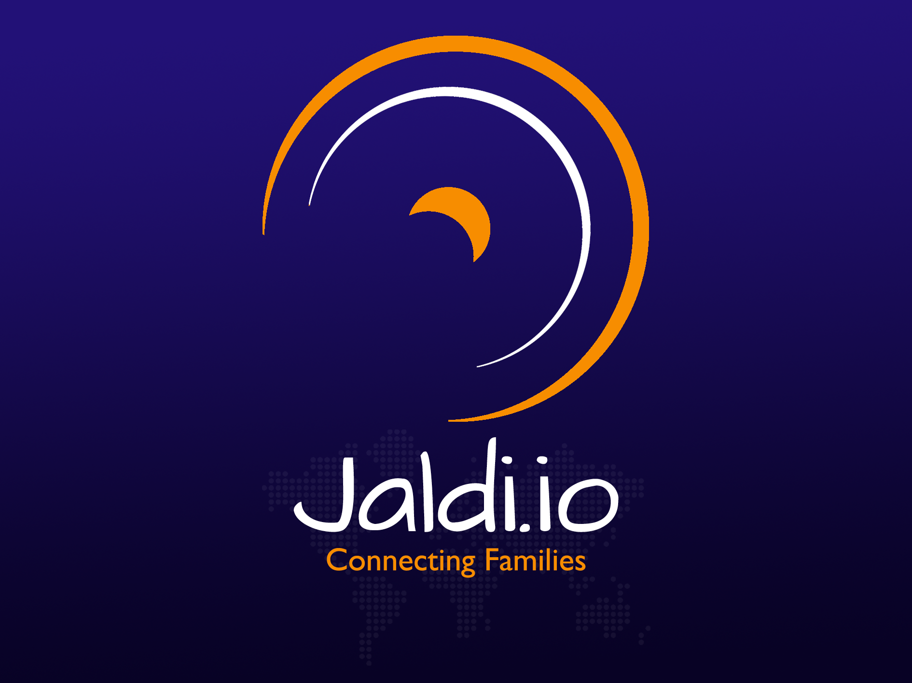

# Jaldi.io Project




This project was bootstrapped with [Create React App](https://github.com/facebookincubator/create-react-app).

ReactJS website for the Jaldi.io project connecting families and providing multiple functionalities.


### How to run

1. Navigate to the source folder of the project.

   ```
   cd (project location)
   ```

2. Navigate to the server folder `cd (server folder location)`

3. Clean install all the server side modules.

   ```
   npm clean-install
   ```

4.  Start the server

   ```
   npm start
   ```

5. Locate the client folder in a new shell. `cd (client folder location)`

6. Clean install all the client side modules.

   ```
   npm clean-install
   ```

7. Start the client

   ```
   npm start
   ```

8. A webpage will open in the default browser with the link: `http://localhost:3000/`

9. If the page doesn't open you can manually type `http://localhost:3000/` in a browser to open the home page.

10. You are now at the homepage of the site.
